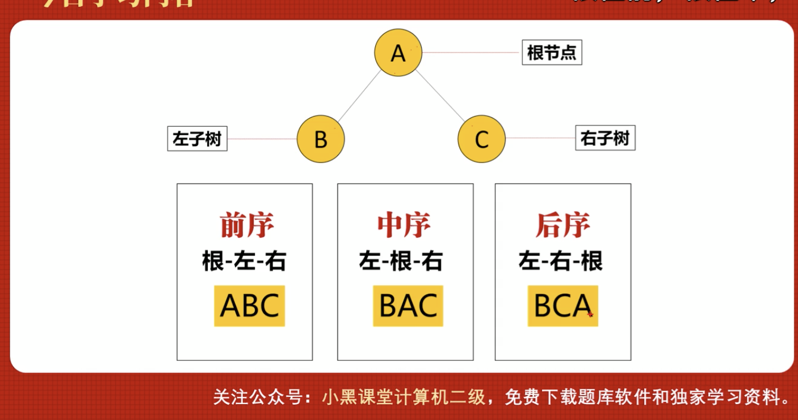

二叉树的下一个结点 (Python）
题目描述：
给定一个二叉树和其中的一个结点，请找出中序遍历顺序的下一个结点并且返回。注意，树中的结点不仅包含左右子结点，同时包含指向父结点的指针。

解题方法
分析二叉树的下一个节点，一共有以下情况：

1.二叉树为空，则返回空；

2.节点右孩子存在，则设置一个指针从该节点的右孩子出发，一直沿着指向左子结点的指针找到的叶子节点即为下一个节点；

3.节点不是根节点。如果该节点是其父节点的左孩子，则返回父节点；否则继续向上遍历其父节点的父节点，重复之前的判断，返回结果。

code

	# -*- coding:utf-8 -*-
	# class TreeLinkNode:
	# 	def __init__(self, x):
	# 		self.val = x
	# 		self.left = None
	#			self.right = None
	#			self.next = None
	class Solution:
		def GetNext(self, pNode):
			if not pNode: return None
			if pNode.right:
				pNode = pNode.right
				while pNode.left:
					pNode = pNode.left
				return pNode
			else:
				while pNode.next:
					if pNode == pNode.next.left:
						return pNode.next
					pNode = pNode.next
			return None

--------------------- 
作者：负雪明烛 
来源：CSDN 
原文：https://blog.csdn.net/fuxuemingzhu/article/details/79723819 
版权声明：本文为博主原创文章，转载请附上博文链接！

